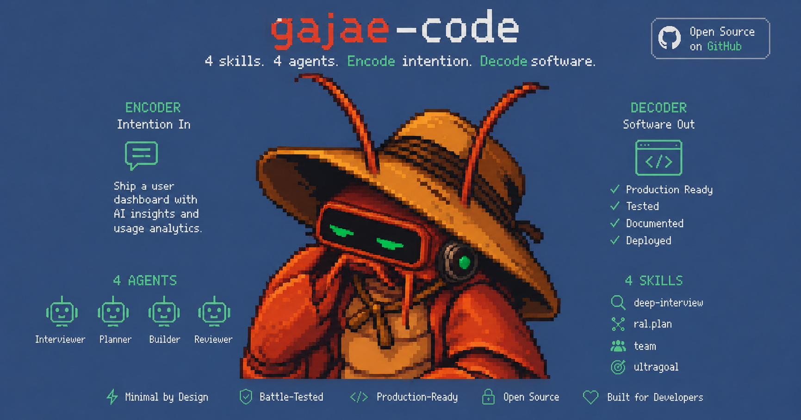

<p align="center">
  
</p>

<h1 align="center">Gajae-Code</h1>

<p align="center">
  <strong>Encode intention. Decode software.</strong><br />
  A focused coding-agent runner for interviews, reviewed plans, tmux-native execution, and durable verification.
</p>

<p align="center">
  <a href="https://www.npmjs.com/package/gajae-code"></a>
  <a href="LICENSE"></a>
  <a href="https://discord.gg/sj4exxQ9v"></a>
</p>

<p align="center">
  
</p>

> Gajae-Code is an experimental, beta-stage project. Expect rough edges and verify outputs before relying on it for important work.

## What is Gajae-Code?

Gajae-Code (`gjc`) is an external coding-agent harness. It runs from the repository or worktree you choose, then gives the agent a small, explicit workflow surface:

```text
deep-interview -> ralplan -> ultragoal
                         └─ optional team execution when parallel tmux workers help
```

It is intentionally not a hidden plugin for Codex CLI, Claude Code, OpenCode, or Claw Code. Start `gjc` beside those tools when you want structured planning, persistent evidence, tmux-backed workers, or an isolated worktree.

## Install

```sh
bun install -g gajae-code
```

The scoped package is also available as `@gajae-code/coding-agent`.

## Quick start

```sh
# Run directly in the current checkout
gjc

# Use a tmux-backed leader session
gjc --tmux

# Use an isolated worktree for risky or reviewable work
gjc --tmux --worktree ../my-task-worktree
```

Inside a GJC session, use the public workflow surface:

```text
/skill:deep-interview clarify ambiguous requirements
/skill:ralplan build and critique the implementation plan
gjc ultragoal create-goals --brief-file <approved-plan>
gjc ultragoal complete-goals
```

Add `gjc team ...` only when coordinated tmux workers materially help.

## Core capabilities

- **Interview before guessing**: `deep-interview` turns vague requests into concrete requirements.
- **Plan before mutation**: `ralplan` reviews the approach before code changes.
- **Execute with evidence**: `ultragoal` tracks goals, revisions, checks, and completion evidence.
- **Parallelize when useful**: `team` coordinates tmux-backed workers for larger tasks.
- **Stay external and reviewable**: run from a chosen repo or worktree without patching another agent runtime.

## Workflow surface

Gajae-Code ships four default workflow skills:

| Skill            | What it does                                                          |
| ---------------- | --------------------------------------------------------------------- |
| `deep-interview` | Clarifies ambiguous requirements before planning or code changes.     |
| `ralplan`        | Builds and critiques an implementation plan before mutation.          |
| `ultragoal`      | Tracks goals through execution, revision, verification, and evidence. |
| `team`           | Coordinates tmux-backed workers when parallel execution is worth it.  |

And four bundled role agents:

| Agent       | What it does                                       |
| ----------- | -------------------------------------------------- |
| `executor`  | Bounded implementation, fixes, and refactors.      |
| `architect` | Read-only architecture and code-review assessment. |
| `planner`   | Read-only sequencing and acceptance criteria.      |
| `critic`    | Read-only plan critique and actionability review.  |

No sprawling default skill zoo: GJC improves by making this small method better.

## Works beside your existing agent

| Tool        | Recommended GJC command                        | Boundary                                               |
| ----------- | ---------------------------------------------- | ------------------------------------------------------ |
| Codex CLI   | `gjc --tmux --worktree <path>` or `gjc`        | External runner; run both from the same repo/worktree. |
| Claude Code | `gjc --tmux` or `gjc --tmux --worktree <path>` | GJC does not become a Claude Code extension.           |
| OpenCode    | `gjc` or `gjc --tmux`                          | External-runner workflow only today.                   |
| Claw Code   | `gjc --tmux --worktree <path>`                 | GJC does not install into or replace Claw Code.        |

For remote-control protocol details, see [`docs/bridge.md`](docs/bridge.md).

## Configuration

Provider retry budgets live in `~/.gjc/config.yml`:

```yaml
retry:
  requestMaxRetries: 4
  streamMaxRetries: 100
  maxRetries: 3
  maxDelayMs: 300000
```

`requestMaxRetries` applies before a stream is established. `streamMaxRetries` applies only to replay-safe transient stream failures. Invalid auth, unsupported models/providers, malformed requests, context overflow, user aborts, and permanent quota failures remain fail-fast.

## TUI identity

The default dark TUI identity is the GJC red-claw theme, while light-appearance terminals default to the bundled blue-crab theme. Explicit user theme settings still win.

## Development

Install dependencies and local defaults:

```sh
bun install
bun run install:defaults
```

Run the CLI from source:

```sh
bun packages/coding-agent/src/cli.ts --help
```

Default workflow definitions live in source, not committed `.gjc` copies:

```text
packages/coding-agent/src/defaults/gjc/skills/<name>/SKILL.md
packages/coding-agent/src/prompts/agents/<role>.md
```

For workflow-definition or rebrand-surface changes, run the project gates:

```sh
bun scripts/check-visible-definitions.ts
bun scripts/verify-g002-gates.ts
bun scripts/rebrand-inventory.ts --strict
bun test packages/coding-agent/test/default-gjc-definitions.test.ts
```

For a package-by-package map, see [`docs/codebase-overview.md`](docs/codebase-overview.md).

## Contributors

Thanks to the people and agents helping shape the early Gajae-Code releases, including [Yeachan-Heo](https://github.com/Yeachan-Heo), [IYENTeam](https://github.com/IYENTeam), and [HaD0Yun](https://github.com/HaD0Yun). Contributions, bug reports, and release validation are welcome through GitHub and the Discord community.

## Inspirations and lineage

Gajae-Code's default TUI identity is the crustacean pair: red-claw for dark appearance and blue-crab for light appearance. It builds on lessons from a small family of agent harnesses while keeping the public GJC surface intentionally focused. Historical attribution is kept in [`NOTICE.md`](NOTICE.md).

## License

MIT. See [`LICENSE`](LICENSE).
